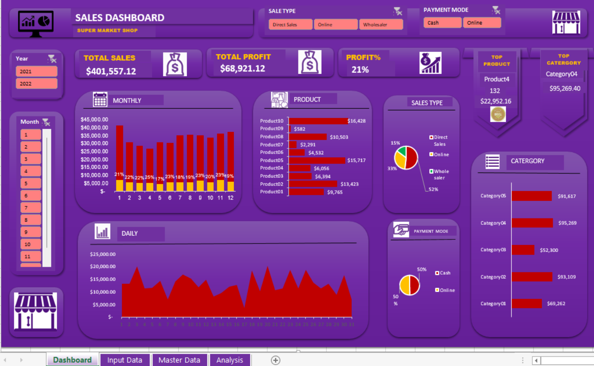
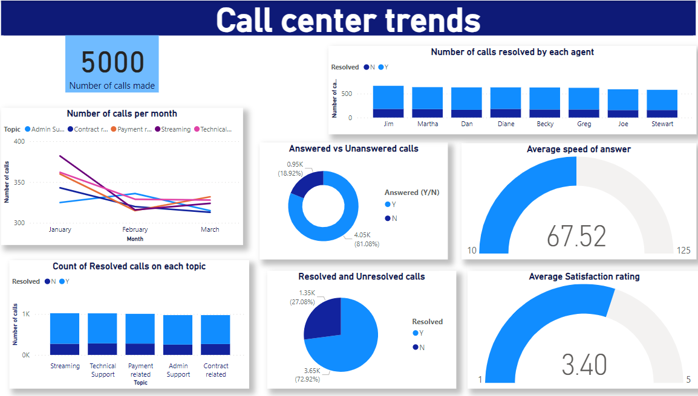
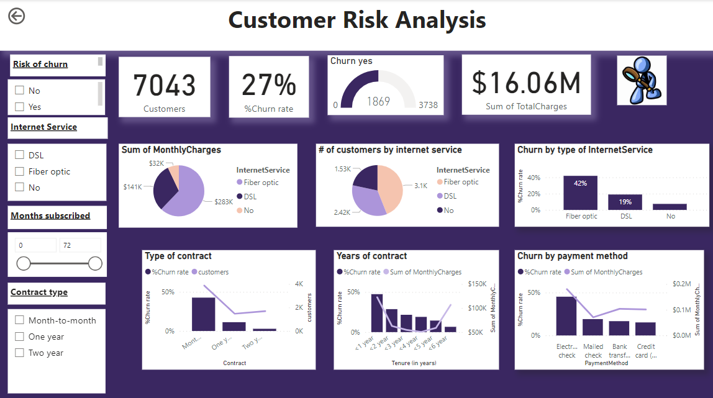
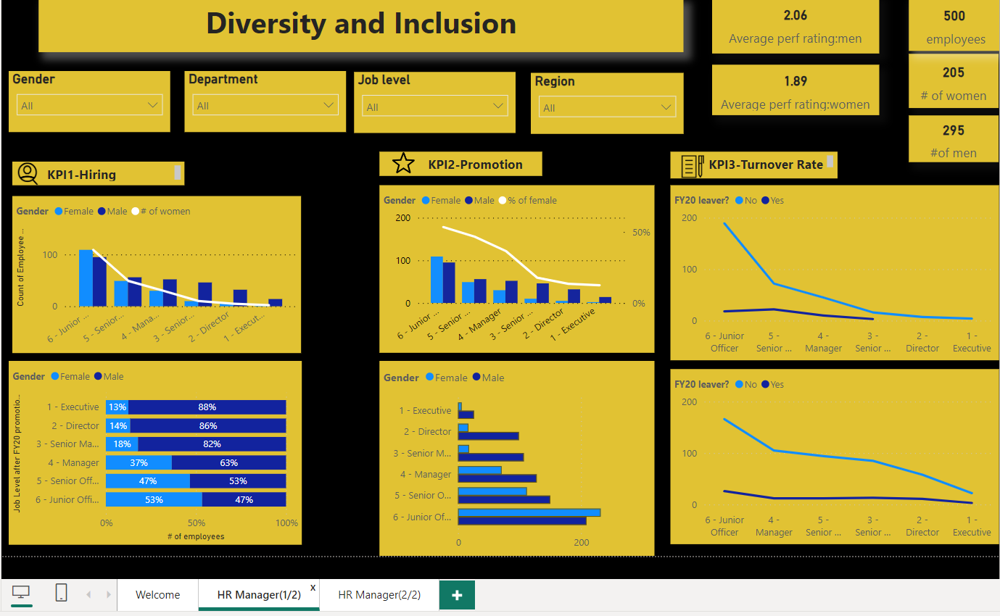

# Maud Kabaira Portfolio

## Ms. Data Science | Data Analyst | Business Intelligence Analyst | Data Governance Analyst | Market Research Analyst | Customer Experience Analyst

## Education
---
### Master’s degree in Data Science 
National University of Science and Technology MISiS | Moscow, Russia.

### Bachelor of Science in Business informatics 
Lobachevsky State University of Nizhny Novgorod | Nizhny Novgorod, Russia.

## Certifications
---
PwC Switzerland-Power BI Job Simulation |Feb 2024

Data Visualisation in Tableau

Google Analytics Individual Qualification

## Technical skills
---
- High level of proficiency with Microsoft Office, including Excel.
- SQL (Structured Query Language)
- Tableau (basic)
- Power BI dashboards
- Python
- Data manipulation and data visualization
- Data cleaning and preprocessing

## Soft skills
---
- Critical thinking
- Strong attention to detail
- Effective communication skills
- Problem solving
- Teamwork

## Projects
---
## Excel Projects

### Supermarket Sales Data Analysis. [More Details](https://github.com/maudrues/Supermarket_sales_analysis)

   

•	Cleaned and prepared database for sales data using Excel.

•	Identified key sales trends and insights, such as customer purchasing behaviours , products and also services provided by the supermarket.

•	Developed interactive Dashboard using Excel and Power Point for Dashboard design. Presented actionable insights and recommendations derived from data analysis in a visually appealing and accessible format on a Dashboard, 
 increasing the probability of stakeholder buy-in and support for proposed strategies.

•	Conducted  analysis of sales data using Excel tools, functions and formulas such as VLOOKUP,OFFSET,Pivot tables, Pivot charts and slicers .

•	Developed data-driven recommendations for optimizing sales strategies

## Power BI Projects

### PWC Switzerland Power BI Simulation on Forage

•	Completed a job simulation where I strengthened my Power BI skills to better understand clients and their data visualization needs.

•	Demonstrated expertise in data visualization through the creation of Power BI dashboards that effectively conveyed KPIs, showcasing the ability to respond to client requests with well-designed solutions.

•	Strong communication skills reflected in the concise and informative email communication with engagement partners, delivering valuable insights and actionable suggestions based on data analysis.

•	Leveraged analytical problem-solving skills to examine HR data, particularly focusing on gender-related KPIs, and identified root causes for gender balance issues at the executive management level, highlighting a commitment to data-driven decision-making.

### ***PwC Project 1(Call center trends)***.[More Details](https://github.com/maudrues/Call_center_trends)    

   

### ***PwC Project 2(Customer retention)*** [More Details](https://github.com/maudrues/Customer-retention-analysis)

 

### PwC Project 3(HR Gender balance) [More Details](https://github.com/maudrues/HR-Diversity-and-Inclusion)                        

                                                                                

## SQL Projects

### Walmart Sales Data Analysis in SQL.[More Details](https://github.com/maudrues/Walmart_sales_data_analysis_SQL)

  

### Museum Paintings Data Analysis in SQL. [More Details](https://github.com/maudrues/Walmart_sales_data_analysis_SQL)

 

This SQL project uses a dataset from Kaggle and then upload it to a PostgreSQL database using Python. Then the data was  analyzed and  20+  intermediate SQL queries were solved.  The dataset used is the famous paintings dataset with 8 tables taken from Kaggle. A simple Python script was used to upload data from CSV files to PostgreSQL database tables. We then use SQL queries to answer over 20 problems related to the famous paintings dataset. Joins ,subquries,etc were used in this project

## Tableau Projects

## Python Projects

### House price prediction University thesis project

•	Used Pandas ,Excel and Python to clean, analyse and predict the prices using different algorithms

•	Deployed the best model on Flask

•	Cleaned and processed a dataset of King County housing records using Pandas and Excel, resulting in a 5% increase in data accuracy and a 40% reduction in data cleaning time compared to manual method.

•	Conducted Exploratory Data Analysis through exploring and visualizing key features of the housing dataset using Python libraries such as Matplotlib and Seaborn. Identified correlations between different variables and housing prices, informing feature selection and model building.

•	Analysed the dataset using Python and implemented 5 different algorithms i.e. multiple linear regression, Random Forest, Decision Tree, 1D CNN and LSTM, achieving Random Forest model as the best model with lowest RMSE and a R2-Score of approximately 97% and 83% on training and testing set.

### Customer Segmentation Project

•	Used Pandas and Python to segment bank customers based on their location and age using K-means clustering.

•	Successfully segmented 1 million + customers into distinct groups.

•	Created informative visualizations using Python libraries such as Matplotlib and Seaborn.

•	Visualised the results and presented recommendations for target marketing.

•	Presented actionable recommendations for target marketing strategies.

